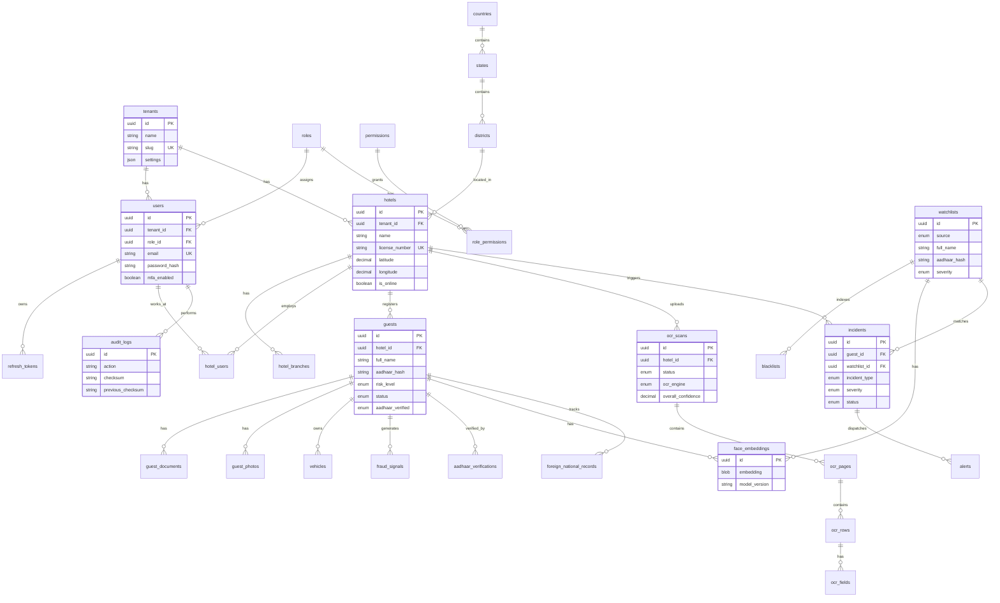

# HMS e-Register — Database ER Diagram

## Entity Relationship Diagram

## Key Indexes

- `guests.aadhaar_hash` — Blacklist matching
- `guests.mobile_number` — Duplicate detection
- `guests.check_in_date` — Analytics queries
- `blacklists.identifier_hash` — Fast exact match
- `audit_logs.created_at` — Audit trail queries
- `hotels.is_online` — Dashboard live count

## Stored Procedures

- `sp_match_blacklist` — Multi-identifier watchlist matching
- `sp_calculate_risk_score` — Aggregate fraud signals into risk score
- `sp_hotel_heartbeat` — Update hotel online status

## Views

- `v_active_guests` — Currently checked-in guests with location
- `v_dashboard_stats` — Real-time command centre metrics
- `v_district_stats` — District-wise hotel and guest counts
